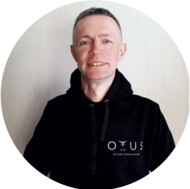
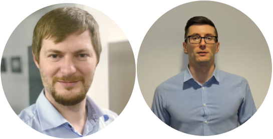
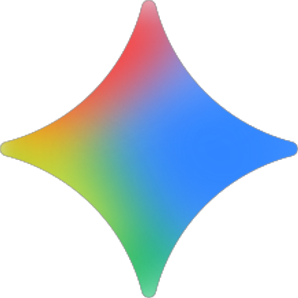
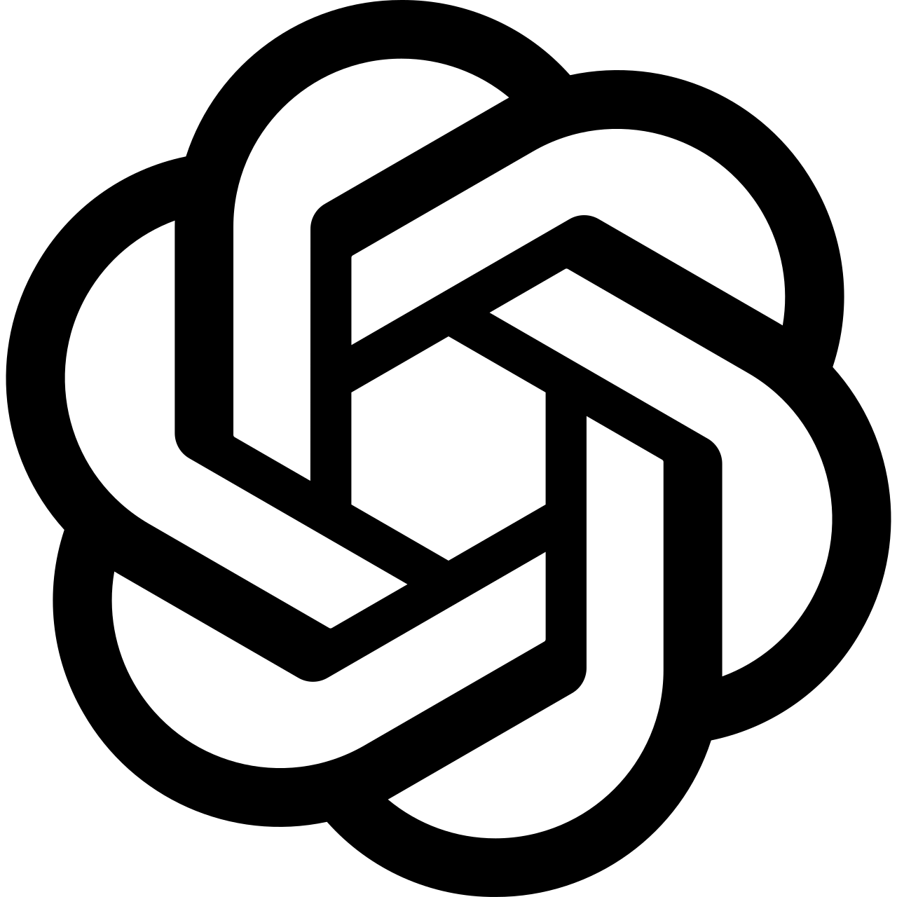

# Об авторе

{ align=left width="200" style="margin-right: 20px; border-radius: 8px;" }

### Кузнецов Игорь 
**Системный аналитик в Major Express / Автор проекта AutoHub**

Приветствую всех коллег и случайных гостей!

Эта работа — итог учебного курса «Системный аналитик. Basic» от образовательной платформы OTUS, и я буду искренне рад, если она поможет вам в обучении и расширит понимание такого непростого, но увлекательного интеллектуального ремесла, как системный анализ. 

Задание ограничивалось одной темой: *«Проектирование информационной системы для СТО в части регистрации клиента и автомобиля, осмотра, составления плана ремонта, формирования заказа-наряда, приёмки автомобиля»*. Всё остальное — сущности, название компании, процессы — вымышлено. Любые совпадения случайны.

Также эта работа — способ доказать самому себе, что даже в 35 лет можно «войти в АйТи», быть полезным окружающим, и даже начать получать от этого удовольствие! Было бы только искреннее желание и усердие)

**Главное: не бойтесь!** Любое непонятное поначалу, если разобрать его по частям, становится доступным. Декомпозиция – наше всё! Даже очень большого слона можно съесть по частям, а Великая Китайская стена тоже когда-то началась с первого положенного камня.

Приятного чтения!

Я в [ТГ](t.me/ig0rkuznets0v) / [ВК](https://vk.ru/igorkuznetsov)

 

---

## Благодарности

Отдельно хочу поблагодарить грамотных, харизматичных, и что самое важное, неравнодушных преподавателей курса:

1. { width="60" height="60" style="border-radius: 50%; vertical-align: middle; margin-right: 12px; object-fit: cover;" } **Павел Грипиняк**  
   Без него работа просто бы не состоялась. Он, без преувеличения, вёл меня с моим проектом по фарватеру между критических несоответствий и непониманием отдельных моментов. Переписка с ним по своей длине, полагаю, превысила высоту стены моей комнаты, но как же продуктивно было это взаимодействие!

2. { width="60" height="60" style="border-radius: 50%; vertical-align: middle; margin-right: 12px; object-fit: cover;" } **Валерий Львов**  
   Руководитель курса, настоящий харизматик и образец для подражания для всех аналитиков, кто хочет научиться бодро, ёмко и правильно формулировать свои мысли.

3. { width="60" height="60" style="border-radius: 50%; vertical-align: middle; margin-right: 12px; object-fit: cover;" } **Мария Красавина**  
   За умелые и чрезвычайно полезные практикумы, смотреть, как она виртуозно работает, успевая при этом чётко излагать базу знаний, просто загляденье!

4. { width="60" height="60" style="border-radius: 50%; vertical-align: middle; margin-right: 12px; object-fit: cover;" } **Михаил Пономарёв и Андрей Трошин**  
   За самопожертвование своим личным временем ради нашего понимания нетривиальных областей знаний. Они постоянно задерживались вне отведённых на занятие академических часов, и методично разжёвывали любые вопросы, даже дилетантские.

5. { width="60" height="60" style="border-radius: 50%; vertical-align: middle; margin-right: 12px; object-fit: cover;" } **Ирина Гертовская**  
   Матёрый специалист и надёжный проводник в сложный, и не всегда очевидный, мир требований. Её слоган *"Требования - не грибы, их не собирают, а выявляют"* будет со мной до конца =)

6. { width="60" height="60" style="border-radius: 50%; vertical-align: middle; margin-right: 12px; object-fit: cover; background: #fff;" } **Google Gemini**  
   За помощь в узконаправленных разборах непонятых мной мест в матчасти системного анализа, и увлекательное реверс-инжиниринг путешествие в мир развёртывания сайтов на GitHub (почти более 200 коммитов, кривые поначалу деплои).

7. { width="60" height="60" style="border-radius: 50%; vertical-align: middle; margin-right: 12px; object-fit: cover; background: #fff;" } **OpenAI ChatGPT**  
   За иллюстрации и помощь с визуальным оформлением.