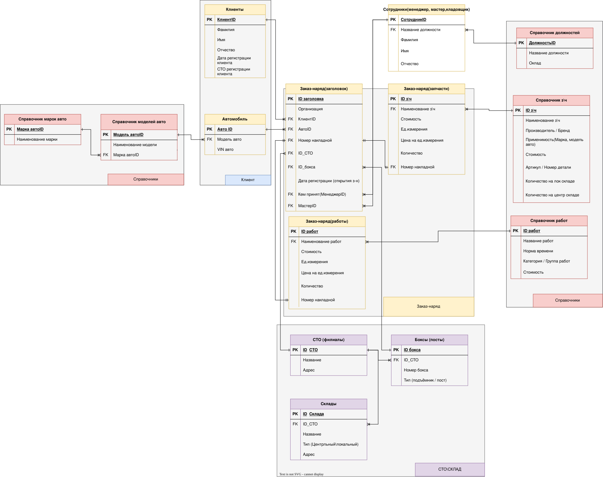

# 7.2. Модель данных

Модель данных определяет логическую структуру хранения информации в системе **AutoHub**, включая таблицы, их атрибуты, первичные и внешние ключи, а также типы связей.

---

## Схема базы данных (ERD)

---

## Описание таблиц и ключей

* **Спецификация таблиц, типов данных и ограничений (PK/FK) приведена в соответствии со схемой выше.*