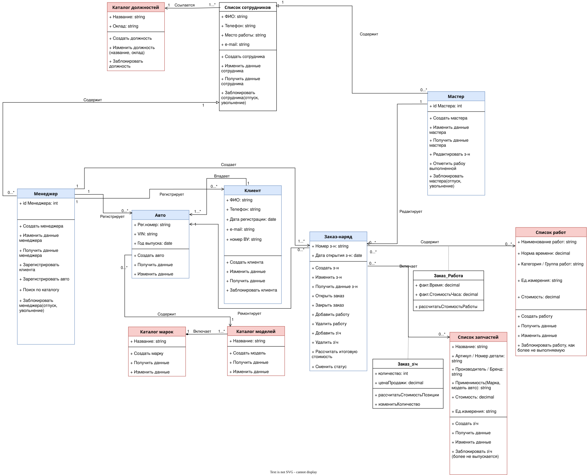

# 7.1. Модель предметной области

В рамках MVP проекта **AutoHub** были выделены основные сущности с атрибутами и определены связи между ними.

Базовыми сущностями являются:

* **Сотрудник** (с ролями Менеджер и Мастер)
* **Клиент**
* **Автомобиль** (включая Марку и Модель)
* **Заказ-наряд**
* **Работа**
* **Запчасть**

---

## Схема предметной области

