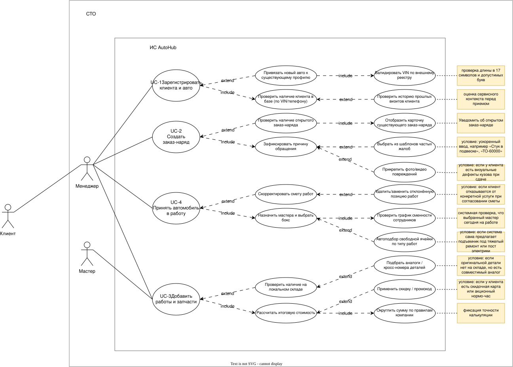

# 6.2. Функциональные требования

## 6.2.1. UseCase диаграмма

Ниже представлена диаграмма прецедентов использования (Use Case) системы **AutoHub**, отражающая ключевые роли пользователей и доступные им функции в рамках процесса принятия автомобиля в работу.

---
## 6.2.2. Описание UseCase, реализуемых в рамках MVP

### UC-1. Зарегистрировать клиента и автомобиль
* **Название:** Зарегистрировать клиента и автомобиль
* **Область действия:** АРМ Менеджера СТО
* **Уровень цели:** Цель пользователя
* **Основное действующее лицо:** Менеджер СТО
* **Участники и интересы:** 
  * *Клиент:* хочет быстрой регистрации и уверенности, что его данные и авто корректно занесены в систему.
  * *Менеджер СТО:* хочет оперативно завести карточку нового клиента без повторных дублей.
* **Предусловия:** Клиент обратился на СТО лично или по телефону; у Менеджера есть доступ к АРМ.
* **Минимальные гарантии:** Система не создает дубликатов при вводе совпадающего VIN или номера телефона.
* **Гарантии успеха:** В базе данных зафиксированы профиль клиента и карточка его автомобиля.
* **Триггер:** Обращение нового клиента или покупка клиентом нового авто.
* **Основной сценарий:**
  1. Менеджер открывает форму поиска клиентов в АРМ.
  2. Менеджер вводит номер телефона или VIN автомобиля.
  3. Система сообщает, что данные в базе отсутствуют.
  4. Менеджер открывает форму «Регистрация нового клиента».
  5. Менеджер вводит ФИО, контактный телефон и e-mail клиента.
  6. Менеджер вводит данные автомобиля (Марка, Модель, VIN, Госномер, Год выпуска).
  7. Система валидирует корректность формата VIN и номера телефона.
  8. Система сохраняет записи и присваивает уникальные `КлиентID` и `АвтоID`.
* **Альтернативные сценарии:**
  * **2.a.** Клиент найден в базе, но автомобиль новый (отсутствует в профиле).
    * 2.a.1. Система отображает найденный профиль клиента.
    * 2.a.2. Менеджер выбирает опцию «Добавить новый автомобиль к клиенту».
    * 2.a.3. Менеджер вводит данные нового авто (Марка, Модель, VIN, Госномер).
    * 2.a.4. Система привязывает новый `АвтоID` к существующему `КлиентID` и завершает сценарий.
  * **2.b.** Клиент и автомобиль уже полностью зарегистрированы в базе.
    * 2.b.1. Система отображает карточку клиента и привязанный авто.
    * 2.b.2. Менеджер подтверждает актуальность данных и завершает сценарий.
* **Исключительный сценарий:**
  * **7.a.** Введен невалидный VIN (меньше 17 символов) или некорректный номер телефона.
    * 7.a.1. Система подсвечивает ошибочные поля красным цветом и блокирует кнопку «Сохранить».
    * 7.a.2. Менеджер исправляет данные с слов клиента.

---

### UC-2. Создать заказ-наряд
* **Название:** Создать заказ-наряд
* **Область действия:** АРМ Менеджера СТО
* **Уровень цели:** Цель пользователя
* **Основное действующее лицо:** Менеджер СТО
* **Участники и интересы:**
  * *Клиент:* хочет получить документ, фиксирующий его обращение и первичные жалобы.
  * *Менеджер СТО:* хочет зафиксировать факт обращения и привязать его к конкретному автомобилю.
* **Предусловия:** Клиент и автомобиль зарегистрированы в базе (`UC-1`).
* **Минимальные гарантии:** Создан черновик документа с уникальным номером.
* **Гарантии успеха:** Заказ-наряд зафиксирован в базе со статусом «Черновик».
* **Триггер:** Приезд клиента на СТО для сдачи автомобиля.
* **Основной сценарий:**
  1. Менеджер в АРМ выбирает зарегистрированный автомобиль клиента.
  2. Менеджер нажимает кнопку «Создать заказ-наряд».
  3. Система автоматически включает сценарий **`UC-1`** (если клиент новый) или сразу загружает данные существующего клиента и авто.
  4. Менеджер вводит причину обращения (первичные жалобы/пожелания клиента).
  5. Система генерирует уникальный номер заказ-наряда, дату создания и присваивает статус **«Черновик»**.
* **Альтернативные сценарии:**
  * **1.a.** Клиент обращается по ранее начатому ремонту.
    * 1.a.1. Менеджер находит незакрытый заказ-наряд и открывает его на редактирование вместо создания нового.
* **Исключительный сценарий:**
  * **2.a.** Клиент или автомобиль находится в стоп-листе / заблокирован (например, задолженность по прошлым визитам).
    * 2.a.1. Система выводит предупреждение «Создание заказ-наряда невозможно: Клиент в стоп-листе».
    * 2.a.2. Менеджер принимает оплату за прошлый визит или согласует условия разблокировки напрямую с клиентом.
    * 2.a.3. Менеджер снимает блокировку в АРМ и возвращается к п. 2 основного сценария.

---

### UC-3. Добавить работы и запчасти
* **Название:** Добавить работы и запчасти
* **Область действия:** АРМ Менеджера СТО / АРМ Мастера
* **Уровень цели:** Цель пользователя
* **Основное действующее лицо:** Менеджер СТО (или Мастер СТО при диагностике)
* **Участники и интересы:**
  * *Клиент:* хочет четкую детализацию по услугам и стоимости материалов.
  * *Мастер / Менеджер:* хотят корректно рассчитать смету ремонта с использованием нормативно-справочной информации.
* **Предусловия:** Заказ-наряд создан в статусе «Черновик» или «На диагностике» (`UC-2`).
* **Минимальные гарантии:** Внесенные позиции сохраняются в калькуляции заказ-наряда.
* **Гарантии успеха:** Рассчитана итоговая стоимость работ и расходных материалов.
* **Триггер:** Формирование сметы ремонта до или во время проведения работ.
* **Основной сценарий:**
  1. Пользователь открывает заказ-наряд в режиме калькуляции.
  2. Пользователь выполняет поиск услуги в справочнике работ.
  3. Система возвращает стоимость и нормо-часы выбранной работы.
  4. Пользователь добавляет работу в заказ-наряд.
  5. Пользователь выполняет поиск нужной детали в справочнике запчастей.
  6. Система подтягивает актуальную цену детали, проверяет доступность и фиксирует количество **на локальном складе при СТО**.
  7. Система автоматически пересчитывает общую сумму заказ-наряда (с точностью `Decimal(10,4)`).
* **Альтернативные сценарии:**
  * **5.a.** Требуемая деталь отсутствует на локальном складе СТО (Сценарий Релиза 1).
    * 5.a.1. Запускается расширяющий сценарий **`UC-REL-2. Оформить заказ недостающей запчасти`**.
* **Исключительный сценарий:**
  * **3.a.** Позиция удалена из справочника или заблокирована.
    * 3.a.1. Система выводит уведомление «Услуга недоступна для выбора».
    * 3.a.2. Пользователь выбирает аналогичную услугу из справочника.

---

### UC-4. Принять автомобиль в работу
* **Название:** Принять автомобиль в работу
* **Область действия:** АРМ Менеджера СТО
* **Уровень цели:** Цель пользователя
* **Основное действующее лицо:** Менеджер СТО
* **Участники и интересы:**
  * *Клиент:* хочет передать автомобиль в цех и знать примерный срок готовности.
  * *Менеджер СТО:* хочет официально зафиксировать приемку авто и передать задачу Мастеру.
  * *Мастер СТО:* хочет получить назначение и принять машину в цеху.
* **Предусловия:** Заказ-наряд создан (`UC-2`), работы и запчасти предварительно согласованы (`UC-3`).
* **Минимальные гарантии:** Заказ-наряд не может быть переведен в статус «В работе» без указания ответственного мастера.
* **Гарантии успеха:** Заказ-наряд переведен в статус «В работе», назначен мастер-исполнитель, машина передана в цех.
* **Триггер:** Согласие клиента на проведение работ и передача ключей.
* **Основной сценарий:**
  1. Менеджер согласовывает с Клиентом предварительный список работ и итоговую стоимость.
  2. Менеджер открывает заказ-наряд в АРМ.
  3. Менеджер выбирает ответственного Мастера-исполнителя из списка доступных сотрудников СТО.
  4. Менеджер выбирает свободный **Бокс / Пост СТО** (например, «Бокс №1 (Подъемник)» или «Пост диагностики»).
  5. Менеджер нажимает кнопку «Принять в работу».
  6. Система меняет статус заказ-наряда с «Черновик» на **«В работе»**, фиксирует выбранный бокс, дату и точное время приема.
  7. Заказ-наряд отображается в АРМ Мастера с привязкой к назначенному боксу.
  8. Клиент передает ключи от автомобиля.
* **Альтернативные сценарии:**
  * **1.a.** Клиент не согласен со стоимостью или сроками.
    * 1.a.1. Менеджер вносит корректировки в список работ (`UC-3`).
    * 1.a.2. При отсутствии согласия Менеджер переводит заказ-наряд в статус «Отменен».
* **Исключительный сценарий:**
  * **4.a.** Выбранный Бокс/Пост СТО уже занят другим активным заказ-нарядом.
    * 4.a.1. Система выдает ошибку «Бокс №X занят до HH:MM».
    * 4.a.2. Менеджер выбирает любой другой свободный бокс из списка.

    
---

## 6.2.3. Описание UseCase, реализуемых в рамках первого релиза

Следующие сценарии вынесены за рамки MVP и запланированы к реализации в **Релизе 1 (Фаза 2)**:

* **UC-REL-1. Проверить наличие и зарезервировать запчасть на складе:** автоматическая проверка остатков на локальном/центральном складах при добавлении детали в заказ-наряд.
* **UC-REL-2. Оформить заказ недостающей запчасти:** формирование заявки кладовщику центрального склада или внешнему поставщику при отсутствии детали на локальном складе.
* **UC-REL-3. Выдача автомобиля и закрытие заказ-наряда:** проведение оплаты, печать акта выполненных работ и перевод заказ-наряда в статус «Завершен».